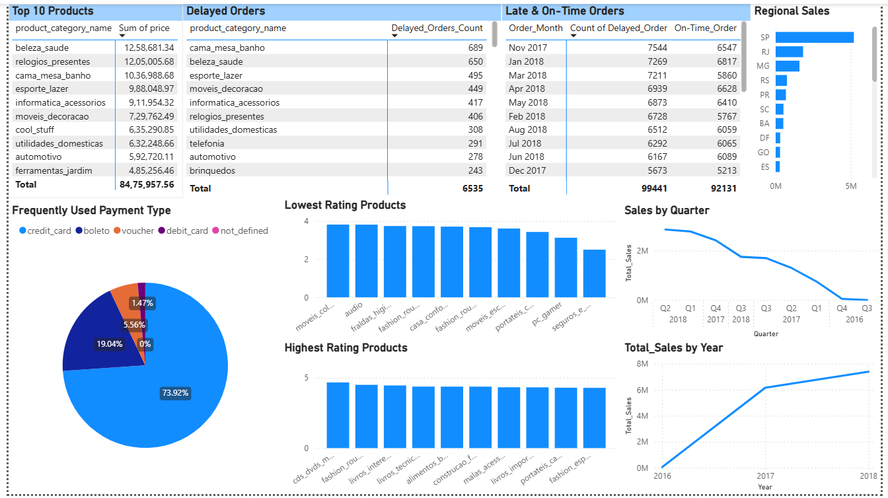
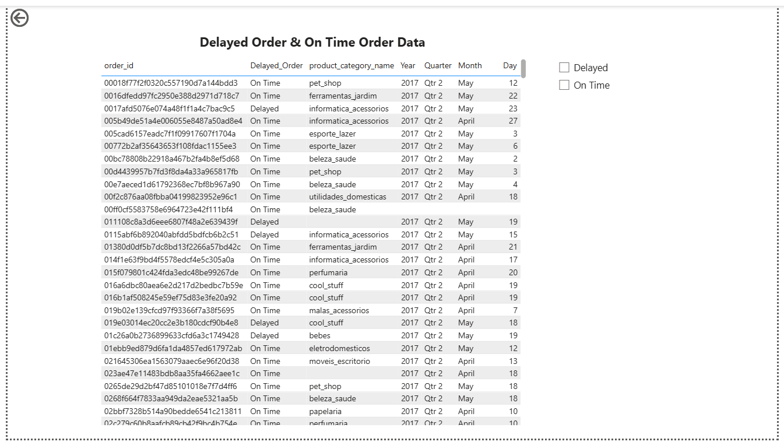

# 📊 ShopNest Sales & Operations Dashboard (Power BI)

## 📌 Project Overview

This project presents an interactive Power BI dashboard developed using the ShopNest e-commerce dataset. The dashboard analyzes sales performance, customer behavior, delivery performance, payment preferences, product ratings, and regional sales trends to support business decision-making.

---
## 🖼️ Dashboard Preview

### Executive Dashboard



---

### Order-Level Drill-Through Analysis



## 🎯 Business Objective

The objective of this project is to help business stakeholders:

- Monitor sales performance
- Identify top-performing product categories
- Analyze delayed vs on-time deliveries
- Understand customer payment preferences
- Evaluate regional sales performance
- Track sales trends over time
- Analyze customer ratings

---

## 📂 Dataset

The dashboard uses multiple related datasets including:

- Customers
- Orders
- Order Items
- Order Payments
- Product Categories
- Products
- Sellers
- Customer Reviews
- Geolocation

---

## 🛠️ Tools & Technologies

- Power BI Desktop
- Power Query
- DAX
- Data Modeling
- DAX Measures

---

## 📊 Dashboard Features
- Interactive Filters
- Drill-through Navigation

### Executive Dashboard

- Top 10 Products by Revenue
- Delayed Orders Analysis
- On-Time vs Delayed Orders
- Regional Sales Performance
- Frequently Used Payment Methods
- Highest Rated Products
- Lowest Rated Products
- Quarterly Sales Trend
- Yearly Sales Trend

### Drill-Through Analysis

Detailed order-level analysis including:

- Order Status
- Product Category
- Order Date
- Delivery Performance

---

## 📈 Key Business Insights

- Beauty & Health generated the highest overall revenue among all product categories.
- Credit Card was the dominant payment method, accounting for nearly three-fourths of all transactions.
- Bed, Bath & Table recorded one of the highest numbers of delayed deliveries, indicating potential logistics challenges.
- Sales showed steady growth between 2016 and 2018.
- Product ratings varied across categories, highlighting opportunities to improve customer satisfaction in lower-rated products.
- Regional sales distribution indicated varying performance across Brazilian states, with São Paulo leading total sales.

---

## 📁 Repository Structure

```
shopnest-sales-dashboard/
│
├── README.md
├── ShopNest Sales & Operations Dashboard.pbix
├── Dataset/
│   ├── Customers.csv
│   ├── Geolocation.csv
│   ├── Order_items.csv
│   ├── Order_payments.csv
│   ├── Order_reviews.csv
|   ├── Orders.csv
│   ├── product_category_name_translation.csv
|   ├── Products.csv
│   └── Sellers.csv
└── Images/
    ├── Executive_Dashboard.png
    └── Drill_Through.png
```

---

## 🚀 Skills Demonstrated

- Data Cleaning
- Data Transformation
- Data Modeling
- DAX Calculations
- Dashboard Design
- Business Analysis
- KPI Reporting
- Data Visualization

---

## 👩‍💻 Author

**Deepa Hegde**

📧 deepamhegde13@gmail.com

💼 https://www.linkedin.com/in/deepamhegde
